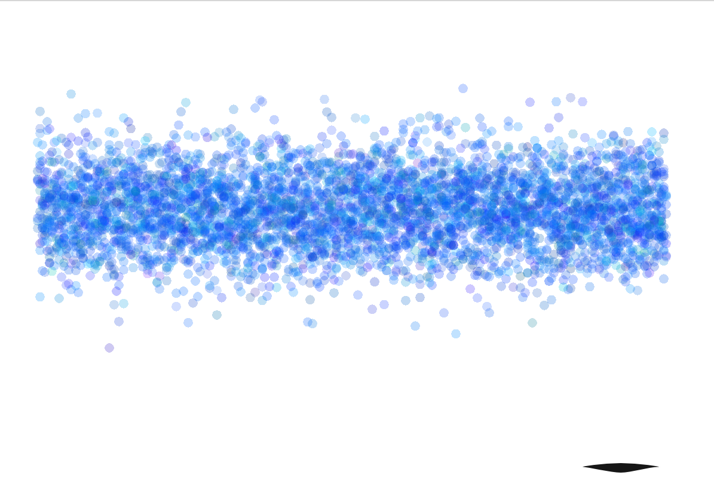

## Gaussian Distribution - Visual demostration

#### Shows majority of points being generated towards the mean, with less of them deviating from it.

Using [libgdx](http://libgdx.badlogicgames.com/) framework.
(Main code in path "/core")

All generated valued can be found on the Y axis, with the mean on the center. The color palette is also generated with normal distribution.

- **Standard Deviation:** _(Default: 30)_  Deviation from the mean used in gaussian distribution. Press SPACE key to modify it.

- **Velocity:** _(Default: 8)_ Modifies velocity of the "shooter", and in consecuence, the spacing between the point on the X axis. Press CONTROL key to modify.

